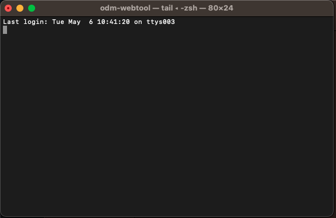
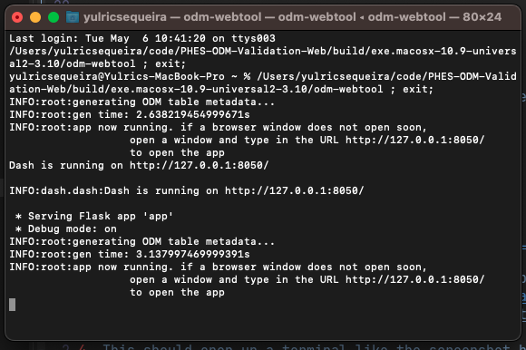
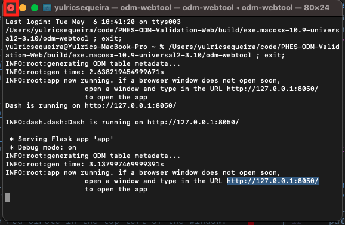
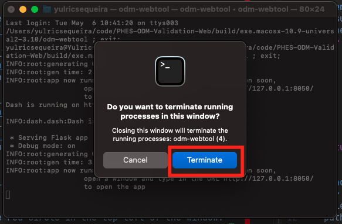

# Mac Distribution Usage

To launch the Mac version of the web tool:

1. Download the Mac version of the webtool from the
   [Github releases page](https://github.com/Big-Life-Lab/PHES-ODM-Validation-Web/releases)
2. The downloaded file is a ZIP and will need to be
   [extracted](https://support.apple.com/en-ca/guide/mac-help/mchlp2528/mac).
3. The extracted folder contains a file called `odm-webtool`. Double click it
   to open the program.
4. This should open up a window that looks like the screenshot below.
   
5. When the window output looks like below, the tool is ready to be used.
   

   A browser window should open automatically but if it does not click on this
   [link](http://127.0.0.1:8050/).

The tool takes some time to set itself up. This may be long on the first run
but subsequent launches should be much faster.

To close the tool simply click the red circle in the top left of the window.
It will ask for confirmation, to which you click `Terminate`. Refer to the
screenshots below.

